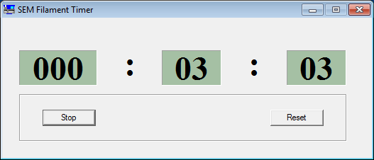
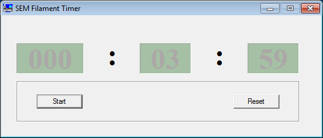

SEM Timer
+++++++++

This is a simple **cumulative timer** that can count up to 1000 hours.  The original
purpose of this timer was to time the lifespan of electron gun filaments used
in an intermittently operated Scanning Electron Microscope (SEM); but it can be
suitable for other uses. For example, it can be used by programmers or solicitors
to count cumulatively the time spent on a project for billing purposes.

Features
--------
* It runs on Microsoft Windows (all versions) and Linux (via Wine) 
  in 32 bit or 64 bit systems.

* Simple intuitive operation with just two buttons  (start/stop and reset).
  No configuration required.
 
* The time is automatically stored between sessions (it even survives a system crash).
  When restarted timing is resumed from the last value.
  Time is saved in a file (``%TEMP%\time_counter.dat``) and in theory, if 
  this file is transfered to another computer, the timer can be resumed there.

* Although this is primarily an hours-minutes timer the seconds  are shown to
  serve as a visual indication of timer activity.

* When the timer is stopped/inactive, this is indicated by a slightly 
  fainted display:

Installation and use
--------------------

SEM Timer is fully portable (i.e. no installation is  needed).  Download the 32
or 64 bit version, unzip the file in some convenient location and click on the
executable file ``timer.exe``.  In Linux it can be run via **Wine** with the command: ``wine timer.exe``.

Compiling the source
---------------------

To compile the SEM timer you need `GNU Make <https://www.gnu.org/software/make/>`_
and the `MinGW GCC <http://www.mingw.org/>`_ compiler. 

* Download the latest source.
  ``git clone https://github.com/proteusx/etcat``

* The default Makefile is for 64 bit architecture.
  To compile for 32 bit change the value of the variable: `ARCH = 32`.

